# 📐 Expense Tracker — System Architecture, Sequence Diagrams, ADRs & Engineering Log

---

## 📑 Table of Contents

1. [Executive Summary & System Overview](#1-executive-summary--system-overview)
2. [System Topology & High-Level Architecture](#2-system-topology--high-level-architecture)
3. [Database Architecture & Schema Definitions](#3-database-architecture--schema-definitions)
4. [Comprehensive Sequence Diagrams](#4-comprehensive-sequence-diagrams)
   - [4.1 User Registration Flow (`/signup`)](#41-user-registration-flow-signup)
   - [4.2 Authentication & JWT Issuance Flow (`/signin`)](#42-authentication--jwt-issuance-flow-signin)
   - [4.3 App Initialization & Token Verification (`/auth`)](#43-app-initialization--token-verification-auth)
   - [4.4 Fetch Expenses Flow (`GET /expenses`)](#44-fetch-expenses-flow-get-expenses)
   - [4.5 Create Expense Flow (`POST /expenses`)](#45-create-expense-flow-post-expenses)
   - [4.6 Update Expense Flow (`PATCH /expenses/:updateId`)](#46-update-expense-flow-patch-expensesupdateid)
   - [4.7 Delete Expense Flow (`DELETE /expenses/:id`)](#47-delete-expense-flow-delete-expensesid)
   - [4.8 Fault Tolerance & Database Error Retry Flow](#48-fault-tolerance--database-error-retry-flow)
   - [4.9 Future Real-Time WebSocket Synchronization Flow](#49-future-real-time-websocket-synchronization-flow)
   - [4.10 Future AI Expense Categorization & Budget Advisory Flow](#410-future-ai-expense-categorization--budget-advisory-flow)
5. [REST API Contract & Specification](#5-rest-api-contract--specification)
6. [Architecture Decision Records (ADRs)](#6-architecture-decision-records-adrs)
   - [ADR-001: Decoupled Single Page Application (SPA) & REST API Monorepo](#adr-001-decoupled-single-page-application-spa--rest-api-monorepo)
   - [ADR-002: Express.js Engine for HTTP REST Routing](#adr-002-expressjs-engine-for-http-rest-routing)
   - [ADR-003: PostgreSQL Persistence Layer Managed via Prisma ORM](#adr-003-postgresql-persistence-layer-managed-via-prisma-orm)
   - [ADR-004: Stateless JSON Web Token (JWT) Bearer Authentication](#adr-004-stateless-json-web-token-jwt-bearer-authentication)
   - [ADR-005: React Component State Architecture & Local Storage Token Strategy](#adr-005-react-component-state-architecture--local-storage-token-strategy)
   - [ADR-006: Dedicated Visual Fault Isolation via DatabaseError Screen & Retry Callbacks](#adr-006-dedicated-visual-fault-isolation-via-databaseerror-screen--retry-callbacks)
   - [ADR-007: Utility-First Styling with Tailwind CSS v4 and Lucide React](#adr-007-utility-first-styling-with-tailwind-css-v4-and-lucide-react)
   - [ADR-008: Real-Time Event Sync Strategy (WebSockets vs Server-Sent Events)](#adr-008-real-time-event-sync-strategy-websockets-vs-server-sent-events)
   - [ADR-009: Token Storage Security Hardening (HttpOnly Cookies vs LocalStorage)](#adr-009-token-storage-security-hardening-httponly-cookies-vs-localstorage)
   - [ADR-010: AI Budget Advisory Pipeline Integration Architecture](#adr-010-ai-budget-advisory-pipeline-integration-architecture)
7. [Running Engineering Log & Incident History](#7-running-engineering-log--incident-history)
   - [7.1 Chronological Milestone Log](#71-chronological-milestone-log)
   - [7.2 Bug Tracking, Root Cause Analysis (RCA) & Remediation Log](#72-bug-tracking-root-cause-analysis-rca--remediation-log)
   - [7.3 Security Audit & Vulnerability Matrix](#73-security-audit--vulnerability-matrix)
   - [7.4 Technical Debt Ledger & Refactoring Roadmap](#74-technical-debt-ledger--refactoring-roadmap)

---

## 1. Executive Summary & System Overview

The **Expense Tracker** system is a multi-tenant personal finance management platform engineered to capture, aggregate, analyze, and visualize daily expenditures across structured financial categories and subcategories.

### Key Architectural Characteristics

- **Client Tier**: React 19 Single-Page Application (SPA) bundled with Vite 8 and styled using Tailwind CSS v4.
- **Application Server Tier**: Node.js runtime executing Express.js 5 with JSON body parsing, CORS policies, and asynchronous route handling.
- **Data Access Tier**: Prisma ORM 6 acting as a type-safe abstraction over PostgreSQL.
- **Persistence Tier**: Relational PostgreSQL database enforcing referential integrity between `User` and `Expense` entities.
- **Security Mechanism**: Salted Bcrypt password hashing (`cost factor = 10`) coupled with HMAC-SHA256 signed JSON Web Tokens (JWT) possessing a 1-hour time-to-live (`TTL = 1h`).

---

## 2. System Topology & High-Level Architecture

### C4 Container Diagram (Level 2)

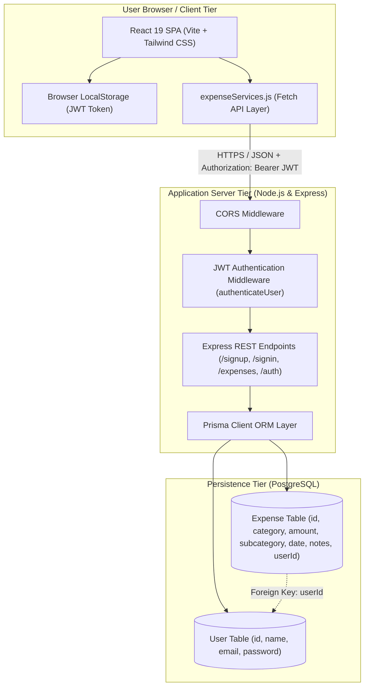

---

## 3. Database Architecture & Schema Definitions

### 3.1 Entity Relationship Diagram (ERD)

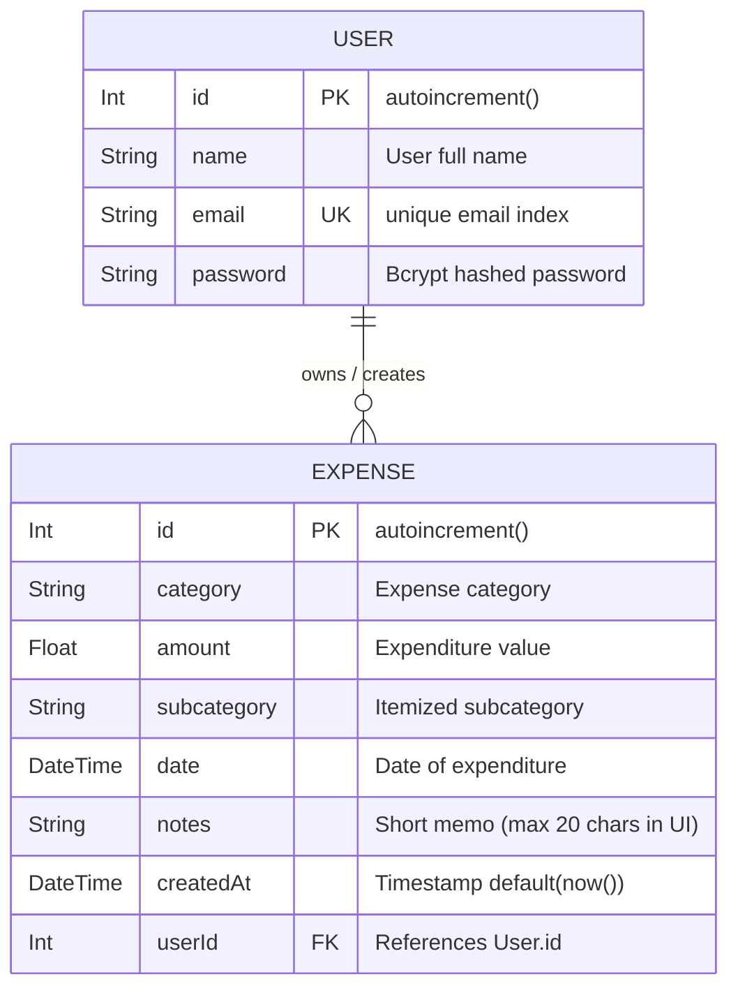

### 3.2 Prisma Schema Specification (`server/prisma/schema.prisma`)

```prisma
// Prisma schema file
generator client {
  provider = "prisma-client-js"
}

datasource db {
  provider = "postgresql"
  url      = env("DATABASE_URL")
}

model Expense {
  id          Int      @id @default(autoincrement())
  category    String
  amount      Float
  subcategory String
  date        DateTime
  notes       String
  createdAt   DateTime @default(now())

  userId      Int
  user        User     @relation(fields: [userId], references: [id])
}

model User {
  id       Int       @id @default(autoincrement())
  name     String
  email    String    @unique
  password String

  expenses Expense[]
}
```

### 3.3 Raw SQL Migration DDL

#### Initial Schema Migration (`20260708182138_init/migration.sql`)

```sql
CREATE TABLE "Expense" (
    "id" SERIAL NOT NULL,
    "category" TEXT NOT NULL,
    "amount" DOUBLE PRECISION NOT NULL,
    "subcategory" TEXT NOT NULL,
    "date" TIMESTAMP(3) NOT NULL,
    "notes" TEXT NOT NULL,
    "createdAt" TIMESTAMP(3) NOT NULL DEFAULT CURRENT_TIMESTAMP,

    CONSTRAINT "Expense_pkey" PRIMARY KEY ("id")
);
```

#### User Multi-Tenancy Migration (`20260730015129_user_created/migration.sql`)

```sql
-- AlterTable: Add foreign key column
ALTER TABLE "Expense" ADD COLUMN "userId" INTEGER NOT NULL;

-- CreateTable: User authentication table
CREATE TABLE "User" (
    "id" SERIAL NOT NULL,
    "name" TEXT NOT NULL,
    "email" TEXT NOT NULL,
    "password" TEXT NOT NULL,

    CONSTRAINT "User_pkey" PRIMARY KEY ("id")
);

-- CreateIndex: Enforce uniqueness on email
CREATE UNIQUE INDEX "User_email_key" ON "User"("email");

-- AddForeignKey: Relational constraint
ALTER TABLE "Expense" ADD CONSTRAINT "Expense_userId_fkey"
FOREIGN KEY ("userId") REFERENCES "User"("id") ON DELETE RESTRICT ON UPDATE CASCADE;
```

---

## 4. Comprehensive Sequence Diagrams

### 4.1 User Registration Flow (`/signup`)

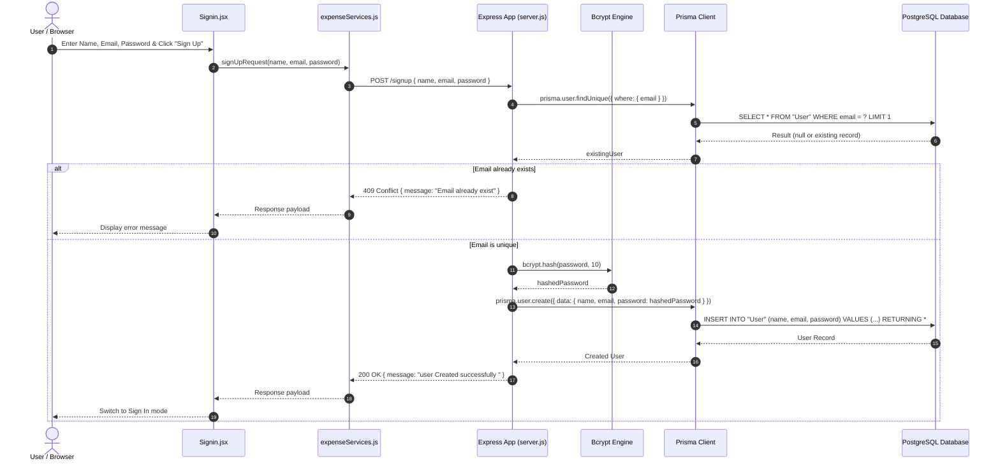

---

### 4.2 Authentication & JWT Issuance Flow (`/signin`)

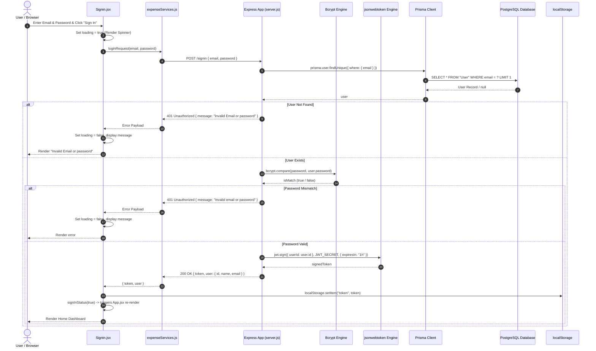

---

### 4.3 App Initialization & Token Verification (`/auth`)

```mermaid
sequenceDiagram
    autonumber
    actor User as User
    participant App as App.jsx
    participant Storage as localStorage
    participant Service as expenseServices.js
    participant AuthMW as authenticateUser (server.js)
    participant Express as Express Endpoint (/auth)

    User->>App: Opens Application in Browser
    App->>App: useEffect() invokes verifyUser()
    App->>Storage: localStorage.getItem("token")
    Storage-->>App: token (or null)

    alt No token found
        App->>App: setIsAuthenticated(false)
        App-->>User: Render <Signin />
    else Token exists
        App->>Service: authencicateUser(token)
        Service->>AuthMW: GET /auth (Header: Authorization: Bearer <token>)
        AuthMW->>AuthMW: jwt.verify(token, JWT_SECRET)
        alt Token Valid
            AuthMW->>Express: req.user = payload; next()
            Express-->>Service: 200 OK { isUserLoggedIn: true }
            Service-->>App: true
            App->>App: setIsAuthenticated(true)
            App-->>User: Render <Home />
        else Token Expired / Invalid
            AuthMW-->>Service: 500 Internal Server Error / 401 Unauthorized
            Service-->>App: false
            App->>App: setIsAuthenticated(false)
            App-->>User: Render <Signin />
        end
    end
```

---

### 4.4 Fetch Expenses Flow (`GET /expenses`)

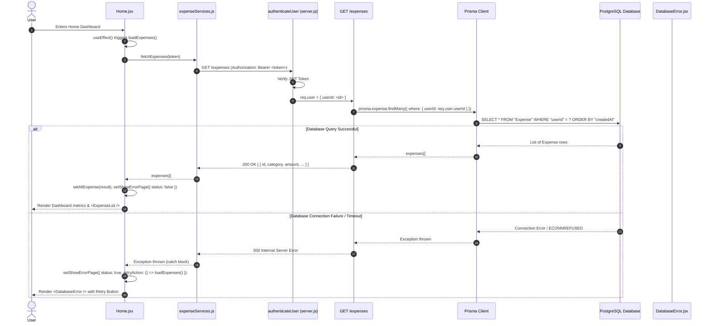

---

### 4.5 Create Expense Flow (`POST /expenses`)

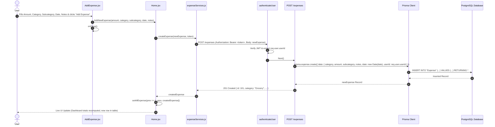

---

### 4.6 Update Expense Flow (`PATCH /expenses/:updateId`)

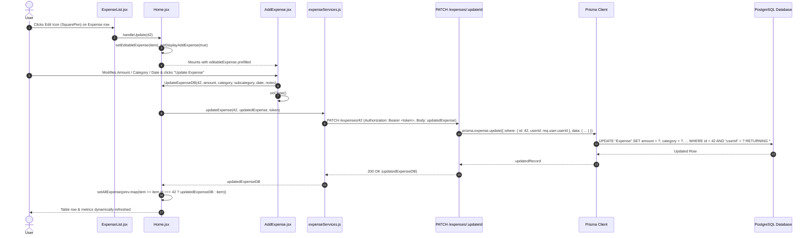

---

### 4.7 Delete Expense Flow (`DELETE /expenses/:id`)

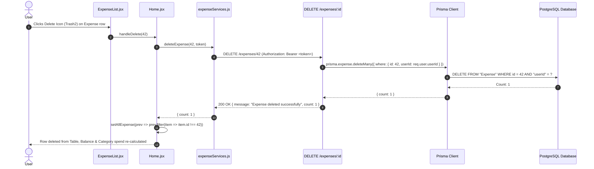

---

### 4.8 Fault Tolerance & Database Error Retry Flow

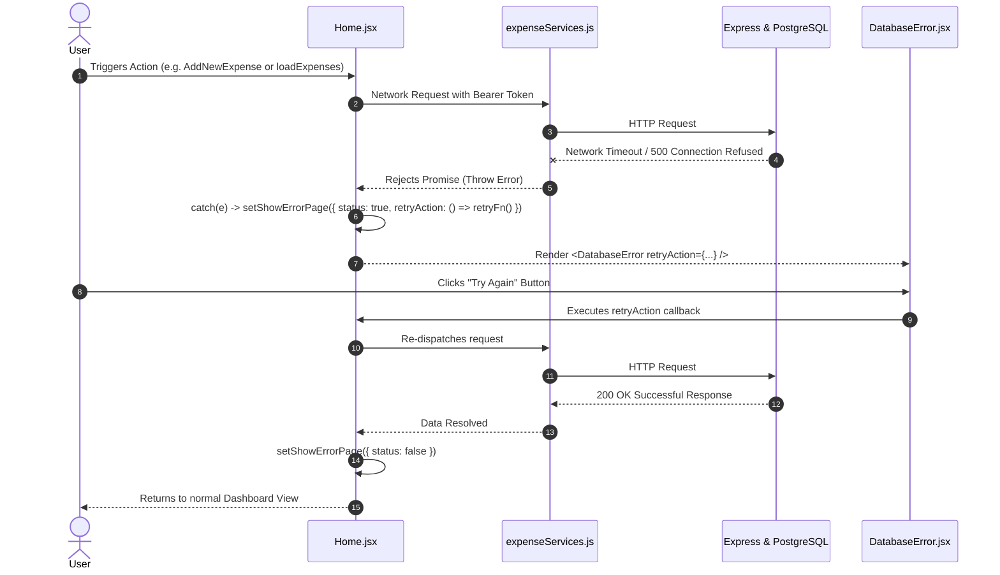

---

### 4.9 Future Real-Time WebSocket Synchronization Flow

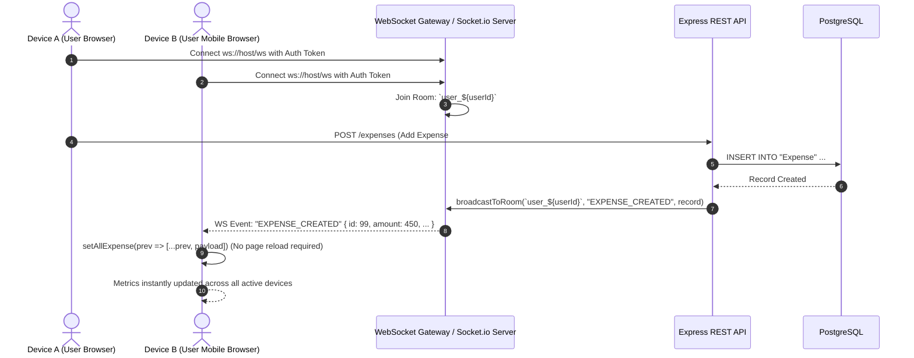

---

### 4.10 Future AI Expense Categorization & Budget Advisory Flow

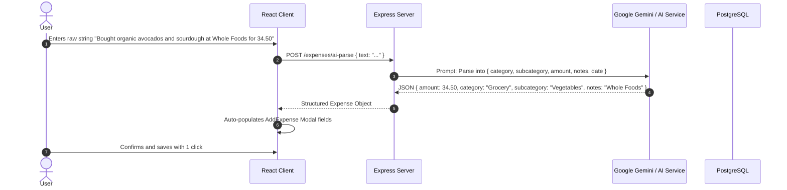

---

## 5. REST API Contract & Specification

| Method   | Route                 | Auth Required | Request Headers                  | Request Body                                                                                                         | Response (Success)                                                                                                                                   | Response (Errors)                                            |
| :------- | :-------------------- | :------------ | :------------------------------- | :------------------------------------------------------------------------------------------------------------------- | :--------------------------------------------------------------------------------------------------------------------------------------------------- | :----------------------------------------------------------- |
| `GET`    | `/`                   | No            | None                             | None                                                                                                                 | `"Homepage"`                                                                                                                                         | `500 Internal Error`                                         |
| `POST`   | `/signup`             | No            | `Content-Type: application/json` | `{ "name": "...", "email": "...", "password": "..." }`                                                               | `200 OK` `{ "message": "user Created successfully " }`                                                                                               | `409 Conflict` (Email exists), `500 Server Error`            |
| `POST`   | `/signin`             | No            | `Content-Type: application/json` | `{ "email": "...", "password": "..." }`                                                                              | `200 OK` `{ "token": "...", "user": { "id": 1, "name": "...", "email": "..." } }`                                                                    | `401 Unauthorized` (Invalid credentials), `500 Server Error` |
| `GET`    | `/auth`               | Yes           | `Authorization: Bearer <JWT>`    | None                                                                                                                 | `200 OK` `{ "isUserLoggedIn": true }`                                                                                                                | `401 Unauthorized`, `500 Server Error`                       |
| `GET`    | `/expenses`           | Yes           | `Authorization: Bearer <JWT>`    | None                                                                                                                 | `200 OK` `[ { "id": 1, "category": "...", "amount": 250.0, "subcategory": "...", "date": "...", "notes": "...", "createdAt": "...", "userId": 1 } ]` | `401 Unauthorized`, `500 Server Error`                       |
| `POST`   | `/expenses`           | Yes           | `Authorization: Bearer <JWT>`    | `{ "category": "Grocery", "amount": 120.5, "subcategory": "Vegetables", "notes": "Tomatoes", "date": "2026-09-12" }` | `201 Created` `{ "id": 1, "category": "...", ... }`                                                                                                  | `401 Unauthorized`, `500 Server Error`                       |
| `PATCH`  | `/expenses/:updateId` | Yes           | `Authorization: Bearer <JWT>`    | `{ "category": "...", "amount": 300, "subcategory": "...", "notes": "...", "date": "2026-09-12" }`                   | `200 OK` `{ "id": 42, "category": "...", ... }`                                                                                                      | `401 Unauthorized`, `500 Server Error`                       |
| `DELETE` | `/expenses/:id`       | Yes           | `Authorization: Bearer <JWT>`    | None                                                                                                                 | `200 OK` `{ "message": "Expense deleted successfully", "count": 1 }`                                                                                 | `401 Unauthorized`, `404 Not Found`, `500 Server Error`      |

---

## 6. Architecture Decision Records (ADRs)

### ADR-001: Decoupled Single Page Application (SPA) & REST API Monorepo

#### Status

**Accepted**

#### Context & Problem Statement

The Expense Tracker requires responsive client rendering, swift CRUD updates, and portable backend deployment. We needed to choose between a Server-Side Rendered (SSR) monolithic framework (e.g. Next.js / Remix) versus a decoupled React SPA with an independent Express REST API within a unified repository.

#### Decision Drivers

1. Need for lightweight, independent horizontal scaling of API server and static frontend assets.
2. Clear separation of concerns between presentation tier and data persistence tier.
3. Fast local development cycle using Vite with Hot Module Replacement (HMR).

#### Decision Outcome & Rationale

We adopted a decoupled client/server repository structure:

- `/client`: React 19 + Vite 8
- `/server`: Express.js 5 + Prisma 6 + PostgreSQL

**Consequences:**

- **Positive**: Clean contract boundary over JSON HTTP REST; frontend can be deployed to Vercel/Netlify while the backend deploys independently to Render/AWS/Fly.io.
- **Negative**: Requires explicit CORS configuration and handling CORS pre-flight (`OPTIONS`) requests.

---

### ADR-002: Express.js Engine for HTTP REST Routing

#### Status

**Accepted**

#### Context & Problem Statement

The backend requires a stable, lightweight HTTP server framework in Node.js to implement authentication, middleware pipelines, and CRUD endpoints for expense management.

#### Decision Drivers

- Minimalist learning curve with mature ecosystem.
- Granular control over middleware execution (`cors`, `express.json()`, custom `authenticateUser`).

#### Decision Outcome & Rationale

Adopted `express@^5.2.1`.

**Consequences:**

- **Positive**: Rapid route authoring, straightforward middleware injection, and zero boilerplate.
- **Negative**: Lacks native TypeScript enforcement or built-in schema validation (e.g., Zod / Joi must be integrated manually).

---

### ADR-003: PostgreSQL Persistence Layer Managed via Prisma ORM

#### Status

**Accepted**

#### Context & Problem Statement

The application handles structured financial transactions requiring referential integrity, strong relational guarantees, ACID compliance, and schema evolution over time.

#### Decision Drivers

1. Strict relational constraints between `User` accounts and `Expense` records.
2. Need for automated, reproducible schema migrations across environments.
3. Auto-generated type definitions for database models.

#### Decision Outcome & Rationale

Selected **PostgreSQL** coupled with **Prisma ORM (`@prisma/client@^6.19.3`, `prisma@^6.19.3`)**.

```prisma
datasource db {
  provider = "postgresql"
  url      = env("DATABASE_URL")
}
```

**Consequences:**

- **Positive**: Declarative schema definition in `schema.prisma`, automatic migration scripts via `npx prisma migrate dev`, and intuitive query API (`prisma.expense.findMany`, `create`, `update`, `deleteMany`).
- **Negative**: Schema changes require running migrations; Prisma query engine binary introduces slight cold-start overhead in serverless runtimes.

---

### ADR-004: Stateless JSON Web Token (JWT) Bearer Authentication

#### Status

**Accepted**

#### Context & Problem Statement

Multi-tenant expense data isolation mandates that every incoming request must identify the calling user without maintaining heavy server-side session stores (e.g. Redis).

#### Decision Drivers

- Stateless scalability.
- Standardized HTTP `Authorization: Bearer <token>` transmission.
- Token signing using HMAC-SHA256 with user ID payload.

#### Decision Outcome & Rationale

Adopted `jsonwebtoken` with 1-hour expiration and `bcrypt` password hashing (salt rounds = 10).

**Server Middleware Implementation:**

```javascript
const authenticateUser = (req, res, next) => {
  try {
    const authHeader = req.headers.authorization;
    if (!authHeader) {
      return res.status(401).json({ message: "Not authorized user" });
    }
    const token = authHeader.split(" ")[1];
    const payload = jwt.verify(token, process.env.JWT_SECRET);
    req.user = payload;
    next();
  } catch (e) {
    console.error(e);
    res.status(500).json({ message: "Internal Server Error" });
  }
};
```

**Consequences:**

- **Positive**: Zero database roundtrips required for session state verification; user ID extracted directly from token.
- **Negative**: Token revocation before 1-hour expiry is not supported without a denylist table; expired tokens return status 500 in current middleware catch block (addressed in Technical Debt).

---

### ADR-005: React Component State Architecture & Local Storage Token Strategy

#### Status

**Accepted**

#### Context & Problem Statement

The frontend requires managing authentication state, active expense collections, filter lists, budget calculations, and modal visibility across components (`App`, `Home`, `Dashboard`, `AddExpense`, `ExpenseList`, `Signin`, `BudgetPlanModal`).

#### Decision Drivers

- Simplicity for the current scope without introducing redundant Redux/Zustand boilerplate.
- Immediate persistence of login state across browser refreshes.

#### Decision Outcome & Rationale

- Managed core data `AllExpense` at root `Home.jsx` level.
- Stored JWT token in browser `localStorage`.
- Passed mutator functions (`AddNewExpense`, `handleDelete`, `UpdateExpenseDB`) via props to child components.

**Consequences:**

- **Positive**: Low complexity, easy to reason about data flow, zero state library overhead.
- **Negative**: Prop drilling through `Home` -> `ExpenseList`/`AddExpense`; `localStorage` exposes tokens to XSS risks (see ADR-009 for cookie migration plan).

---

### ADR-006: Dedicated Visual Fault Isolation via DatabaseError Screen & Retry Callbacks

#### Status

**Accepted**

#### Context & Problem Statement

Network drops or backend cold starts (e.g., on free tier cloud database instances) can cause fetch promises to reject, leaving users with empty or broken screens.

#### Decision Drivers

- Clear user feedback during database outages.
- Seamless recovery without losing user context or forcing full browser reloads.

#### Decision Outcome & Rationale

Engineered a centralized `showErrorPage` state in `Home.jsx` wrapping a dedicated `<DatabaseError retryAction={...} />` component. The failed asynchronous operation is enclosed in a lambda and passed as `retryAction`.

```javascript
// State in Home.jsx
const [showErrorPage, setShowErrorPage] = useState({ status: false, retryAction: null });

// Catch block pattern
catch (e) {
  setShowErrorPage({
    status: true,
    retryAction: () => AddNewExpense(amount, category, subcategory, date, notes)
  });
}
```

**Consequences:**

- **Positive**: Elegant recovery UX; users can click "Try Again" to re-execute the exact failed operation once connectivity resumes.
- **Negative**: Component-level try/catch boilerplate must be maintained across each service call.

---

### ADR-007: Utility-First Styling with Tailwind CSS v4 and Lucide React

#### Status

**Accepted**

#### Context & Problem Statement

The UI required a modern, responsive, aesthetic theme featuring gradients, rounded cards, modal dialogs, and clean tabular data with minimal CSS overhead.

#### Decision Drivers

- Responsive breakpoints (`sm`, `md`, `lg`) out of the box.
- Modern visual aesthetics (e.g., `bg-linear-to-br from-violet-100 via-purple-50 to-indigo-100`, soft shadows, pill action buttons).
- Lightweight, tree-shakeable icons (`lucide-react`).

#### Decision Outcome & Rationale

Integrated `@tailwindcss/vite` and `tailwindcss@^4.3.2` with `lucide-react` icons (`Wallet`, `SquarePen`, `Trash2`, `ShoppingCart`, `Sparkles`, `PiggyBank`, `Database`, `RefreshCw`).

**Consequences:**

- **Positive**: High development speed, unified color tokens, responsive dashboard grid.
- **Negative**: HTML class attribute density.

---

### ADR-008: Real-Time Event Sync Strategy (WebSockets vs Server-Sent Events)

#### Status

**Proposed (Target Roadmap)**

#### Context & Problem Statement

When a user updates expenses on a mobile browser or second tab, the desktop UI remains stale until manually refreshed.

#### Decision Drivers

- Instant bidirectional synchronization across active user sessions.
- Minimal server overhead.

#### Decision Outcome & Rationale

Will implement **Socket.io** over WebSockets:

- When a user logs in, a socket connects and joins room `user_${userId}`.
- Backend CRUD controllers emit `EXPENSE_CREATED`, `EXPENSE_UPDATED`, and `EXPENSE_DELETED` events to room `user_${userId}`.
- React frontend listens on socket events and updates `setAllExpense` state reactively.

---

### ADR-009: Token Storage Security Hardening (HttpOnly Cookies vs LocalStorage)

#### Status

**Proposed (Target Roadmap)**

#### Context & Problem Statement

Storing JWTs in `localStorage` leaves tokens vulnerable to extraction via Cross-Site Scripting (XSS).

#### Decision Drivers

- Protection against script-based token exfiltration.
- Automatic browser cookie inclusion on API requests.

#### Decision Outcome & Rationale

Transition from `localStorage.setItem("token", token)` to **`Set-Cookie: token=...; HttpOnly; Secure; SameSite=Strict`**:

- Express backend will issue `res.cookie(...)` on `/signin`.
- Client requests will pass cookies automatically via `credentials: "include"`.
- Token becomes inaccessible to client JavaScript execution contexts.

---

### ADR-010: AI Budget Advisory Pipeline Integration Architecture

#### Status

**Proposed (Target Roadmap)**

#### Context & Problem Statement

Users desire natural language expense logging (e.g., voice or chat prompts) and automatic monthly savings advice.

#### Decision Drivers

- Low latency LLM execution.
- Strict JSON schema output for deterministic database insertion.

#### Decision Outcome & Rationale

Implement a dedicated backend endpoint `POST /api/ai/parse-expense` calling Google Gemini Flash API:

- Backend passes user prompt with structured response schema (`amount`, `category`, `subcategory`, `notes`, `date`).
- Returns validated payload directly to the frontend `AddExpense` modal for single-tap confirmation.

---

## 7. Running Engineering Log & Incident History

### 7.1 Chronological Milestone Log

| Date           | Milestone / Component                   | Author      | Description & Architectural Impact                                                                                                                                                                                                    |
| :------------- | :-------------------------------------- | :---------- | :------------------------------------------------------------------------------------------------------------------------------------------------------------------------------------------------------------------------------------ |
| **2026-07-08** | Initial Backend & Single-Tenant Schema  | Abhay Kumar | Created `Expense` table with fields `id`, `category`, `amount`, `subcategory`, `date`, `notes`, `createdAt`. Initialized Prisma ORM with PostgreSQL. Built basic Express CRUD endpoints (`GET`, `POST`, `PATCH`, `DELETE`).           |
| **2026-07-30** | Multi-Tenancy & JWT Auth Layer          | Abhay Kumar | Added `User` table with unique `email` index and hashed `password`. Added foreign key constraint `Expense.userId -> User.id`. Implemented `/signup` with bcrypt hashing and `/signin` issuing HMAC-SHA256 JWT tokens with 1-hour TTL. |
| **2026-08-14** | Client UI & Dynamic Category Mapping    | Abhay Kumar | Rebuilt UI in Tailwind CSS. Implemented structured category/subcategory mapping in `storage/constant.js` covering 16 distinct categories (Grocery, Savings, LifeStyle, Rent, Bills, etc.).                                            |
| **2026-08-28** | Modal Overlays & Dashboard Calculations | Abhay Kumar | Added `AddExpense` modal supporting both creation and prefilled editing. Added `Dashboard.jsx` calculating live aggregated metrics (`totalSpendNow`, `TotalSavings`, `Grocery`, `LifeStyle`, and `Balance`).                          |
| **2026-09-02** | Fault Isolation & Error Recovery        | Abhay Kumar | Built `DatabaseError.jsx` with retry closure support, isolating backend downtime and allowing instant user-driven recovery.                                                                                                           |
| **2026-09-10** | Monthly Budget Planning Modal           | Abhay Kumar | Built `BudgetPlanModal.jsx` allowing users to configure monthly starting amount and spend/savings ceilings for key expense categories.                                                                                                |

---

### 7.2 Bug Tracking, Root Cause Analysis (RCA) & Remediation Log

#### 🐛 Incident Log #1: Sign-in Latency & Blank UI on Cold Start

- **Symptom**: When signing in, the UI appeared frozen for 1.5–3 seconds with no visual indication of progress.
- **Root Cause**: Backend bcrypt password verification and database cold connection created noticeable latency without client feedback.
- **Remediation**: Added `loading` state to `Signin.jsx` that replaces the submit button text with `"Signing in ..."` and mounts `<LoadingSpinner />` during network resolution.
- **Status**: ✅ **Resolved**

#### 🐛 Incident Log #2: Inconsistent Card & Border Contrast

- **Symptom**: Dashboard cards had mismatched border hues across different category containers.
- **Root Cause**: Ad-hoc border utility classes (`border-gray-200`, `border-rose-100`, `border-blue-100`, `border-amber-100`, `border-fuchsia-100`) without unified tokenization.
- **Remediation**: Standardized component card borders and background tints across `Dashboard.jsx` and `ExpenseList.jsx`.
- **Status**: ✅ **Resolved**

#### 🐛 Incident Log #3: Table Layout Collapse on Zero Records

- **Symptom**: When no expenses existed, the table collapsed and the page container did not stretch to full viewport height.
- **Root Cause**: Missing fallback empty state view and container lacking `min-h-screen`.
- **Remediation**: Added conditional fallback `"Add your first expense to start tracking"` in `ExpenseList.jsx` and assigned `min-h-screen` to the main wrapper in `Home.jsx`.
- **Status**: ✅ **Resolved**

#### 🐛 Incident Log #4: Multi-Tab / Multi-Device UI State Stale Bug

- **Symptom**: Updating or adding an expense in Tab 1 did not reflect in Tab 2 without a manual page refresh.
- **Root Cause**: React state is strictly memory-isolated per browser instance; no background polling or WebSocket event listener exists.
- **Remediation**: Formulated ADR-008 for Socket.io integration to broadcast real-time mutation events across user rooms.
- **Status**: 🔄 **In Progress / Planned for Socket Sprint**

#### 🐛 Incident Log #5: Production Deployment Overwritten by Unvetted Commits

- **Symptom**: Deployments triggered on every git push, inadvertently deploying unfinished features to live users.
- **Root Cause**: Continuous Deployment (CD) pipeline bound directly to `main` branch push events.
- **Remediation**: Configured deployment gating using semantic GitHub release tags (`v1.0.0`, `v1.1.0`), pausing automatic commit-based deployments.
- **Status**: ✅ **Resolved**

---

### 7.3 Security Audit & Vulnerability Matrix

| Component              | Identified Risk                                                                    | Impact Level | Mitigation Strategy                                                                            | Mitigation Status    |
| :--------------------- | :--------------------------------------------------------------------------------- | :----------- | :--------------------------------------------------------------------------------------------- | :------------------- |
| **Token Storage**      | Storing JWT in `localStorage` allows XSS payload access                            | High         | Migrate token storage to `HttpOnly`, `SameSite=Strict` secure cookies (ADR-009)                | 🔄 Planned           |
| **JWT Error Handling** | `jwt.verify` failure in `authenticateUser` returns generic HTTP 500 instead of 401 | Medium       | Refactor `server.js` middleware to catch `JsonWebTokenError` and return `401 Unauthorized`     | 🔄 Scheduled         |
| **Input Validation**   | API routes lack schema validator (e.g. negative amounts or malformed dates)        | Medium       | Integrate Zod schema validation middleware on `POST /expenses` and `PATCH /expenses/:updateId` | 🔄 Scheduled         |
| **Rate Limiting**      | `/signin` and `/signup` endpoints are vulnerable to brute force attempts           | High         | Implement `express-rate-limit` (e.g., max 5 attempts per IP per 15 minutes)                    | 🔄 Scheduled         |
| **Password Storage**   | Bcrypt hashing with salt factor 10                                                 | Low (Secure) | Maintained standard Bcrypt hashing algorithm                                                   | ✅ Active & Verified |

---

### 7.4 Technical Debt Ledger & Refactoring Roadmap

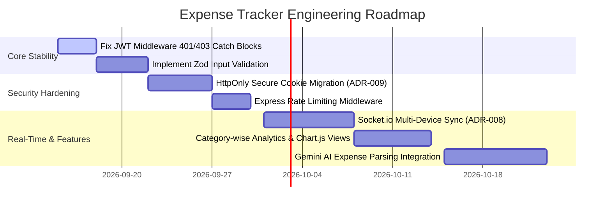

1. **JWT Middleware Error Handling**: Update `server.js` lines 22–43 to explicitly differentiate between token expiration (`TokenExpiredError` -> 401), invalid signature (`JsonWebTokenError` -> 401), and genuine server errors (500).
2. **Category / Subcategory Validation**: Enforce that incoming `subcategory` strings in `POST /expenses` belong strictly to the allowed list in `CATEGORY` and `SUBCATEGORY` mapping dictionaries.
3. **Automated Unit & Integration Testing**: Introduce Jest / Supertest for backend REST route coverage and Vitest + React Testing Library for frontend component unit tests.
4. **Database Backup Automation**: Implement scheduled PostgreSQL automated dump scripts (`pg_dump`) to secure database snapshots.
