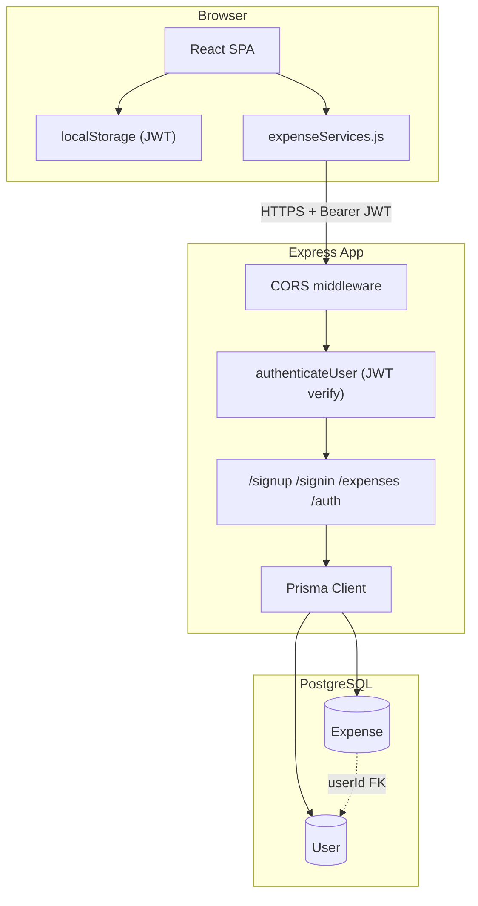
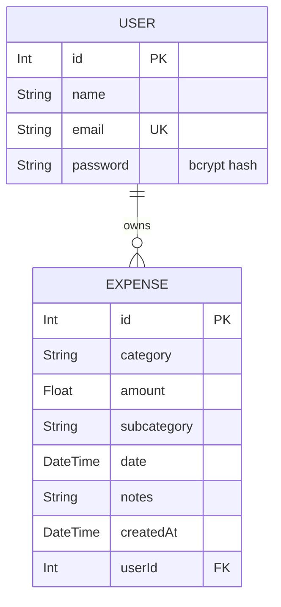
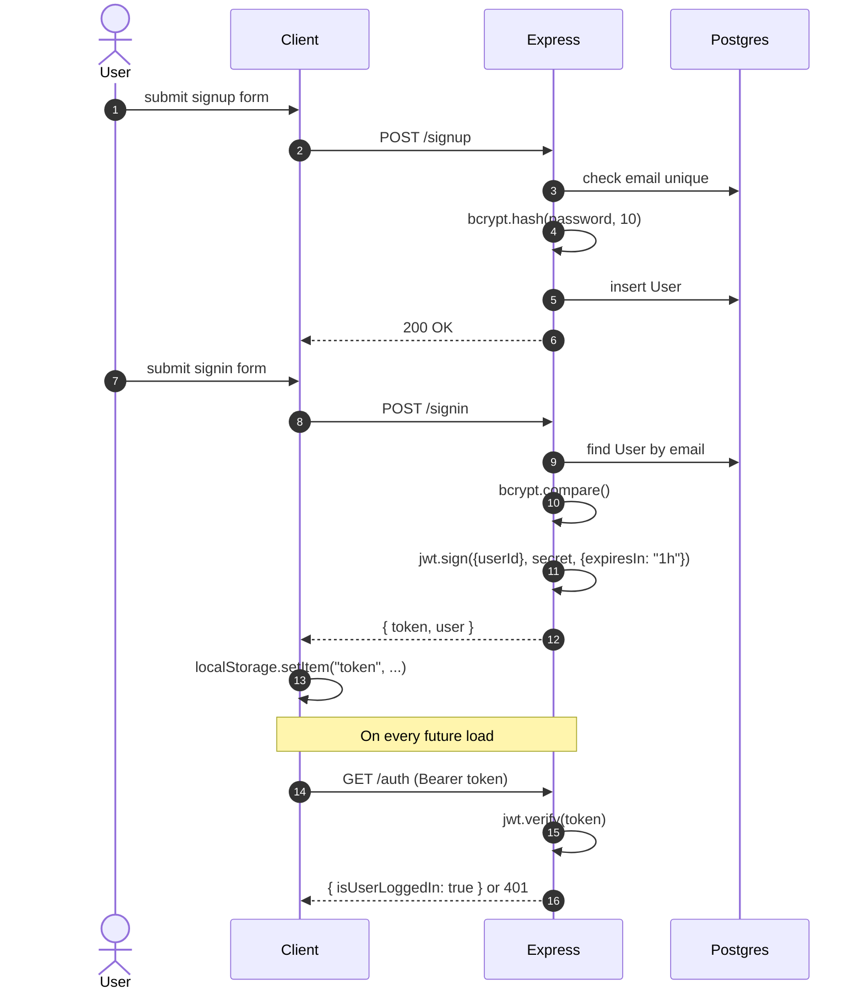
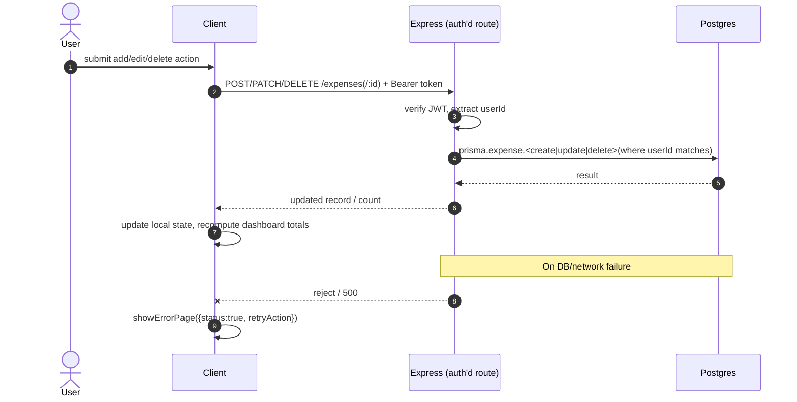

# 💰 Expense Tracker

A full-stack Expense Tracker application built with **React, Express.js, Prisma ORM, and PostgreSQL**.

The application allows users to manage their daily expenses with complete CRUD functionality and serves as a backend learning project focused on modern full-stack development.

---

# 🚀 Features

- ✅ Add Expense
- ✅ View Expenses
- ✅ Update Expense
- ✅ Delete Expense
- ✅ PostgreSQL Database Integration
- ✅ REST API using Express.js
- ✅ Prisma ORM
- ✅ Responsive UI
- 🔄 Dashboard (In Progress)
- 🔄 Expense Analytics (Planned)
- 🔄 AI Expense Suggestions (Planned)
- 
##  System Topology & High-Level Architecture

### 1. C4 Container Diagram (Level 2)
---


---

## 2. Data Model



```prisma
model User {
  id       Int       @id @default(autoincrement())
  name     String
  email    String    @unique
  password String
  expenses Expense[]
}

model Expense {
  id          Int      @id @default(autoincrement())
  category    String
  amount      Float
  subcategory String
  date        DateTime
  notes       String
  createdAt   DateTime @default(now())
  userId      Int
  user        User     @relation(fields: [userId], references: [id])
}
```

---

## 3. Key Flows

### Auth (signup → signin → session verify)



### Expense mutation (create/update/delete — same shape)



---

## 4. Design Decisions (the ones actually worth recording)

**JWT in localStorage vs. HttpOnly cookie** — chose localStorage for v1 to ship faster; it's readable by any injected script (XSS risk). Migration to `HttpOnly; Secure; SameSite=Strict` cookies is the highest-priority hardening item below, not yet done.

**Stateless JWT (no session store)** — no Redis/session table needed, but means no way to revoke a token before its 1h expiry without adding a denylist table. Acceptable for now given the low stakes of this app; revisit if this ever handles real financial data.

**Prisma over raw SQL** — worth it for the migration tooling and type safety at this schema size; the cold-start overhead only matters on serverless, not relevant on Render.

---

## 5. Known Issues / Technical Debt

| Issue | Why it matters | Fix |
|---|---|---|
| `authenticateUser` returns `500` on expired/invalid JWT instead of `401` | Client can't distinguish "you're logged out" from "server broke" | Catch `TokenExpiredError`/`JsonWebTokenError` explicitly, return 401 |
| JWT stored in `localStorage` | XSS-readable | Move to `HttpOnly` cookie |
| No rate limiting on `/signin`, `/signup` | Brute-force risk | `express-rate-limit`, ~5 attempts/15min/IP |
| No server-side input validation | Bad data (negative amounts, malformed dates) can land in DB | Zod schema on write routes |
| No sync across tabs/devices | Stale UI until manual refresh | Socket.io broadcast per `user_${userId}` room (see below) |

---

## 6. Planned / Not Built Yet

- **Real-time sync**: Socket.io room per user, broadcast `EXPENSE_CREATED/UPDATED/DELETED` on mutation
- **AI expense parsing**: free-text input → LLM call → structured `{amount, category, subcategory, notes, date}` → prefill the add-expense form
- **Analytics view**: category-wise breakdown over time with Chart.js

---

## 7. Changelog

| Date | Change |
|---|---|
| 2026-07-08 | Initial `Expense` model + CRUD endpoints |
| 2026-07-30 | Added `User` model, JWT auth, per-user data isolation |
| 2026-08-14 | Rebuilt UI in Tailwind, structured category/subcategory mapping |
| 2026-08-28 | Add/edit modal, dashboard aggregate calculations |
| 2026-09-02 | Error-boundary + retry UX for DB/network failures |
| 2026-09-10 | Monthly budget planning modal |
